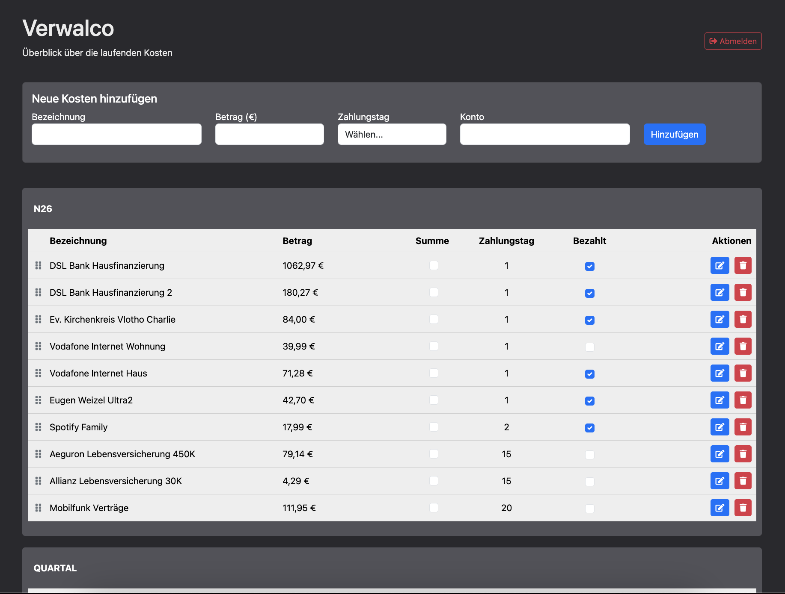

# Verwalco - Verwaltung und Kontrolle

Eine Webanwendung zur Verwaltung und Kontrolle der Laufenden Kosten.
Man trägt die Laufenden Kosten ein und trennt die nach Konten.
Man gibt Bezeichnung, den Betrag, Zahlungstag und Konto ein.

Die Einträge werden nach Zahlungstag und Konto sortiert.
Man kann die Einträge beliebig verschieben, bearbeiten und löschen.
Bei dieser Version sind die Muster-Einträge vorhanden, um zu sehen 
wie das ganze aussieht. Man kann die Einträge natürlich alle löschen.

Mit der Funktion "Summe" kann man beliebigen Positionen summieren um z.B. zu sehen, 
wie viel noch von der jeweiligen Konto abgebucht wird.

Wenn die Liste fertiggestellt ist, sieht man unten die Gesamtsumme der Ausgaben.
Man klickt der Checkbox "Bezahlt" bei der abgebuchten Beträgen im laufe des Monats an.
Bezahlte Posten werden vom Gesamtbetrag abgezogen. 

Man sieht unten noch offenen Gesamtbetrag und weißt dann ganz genau was noch alles
und wann abgebucht wird. So hat man besseren Überblick über die Ausgaben und kann
den Family-Budget besser planen.



## Installation

1. Stellen Sie sicher, dass Python (Version 3.x) auf Ihrem System installiert ist.

2. Klonen Sie das Repository:
   ```bash
   git clone git@github.com:NovaRecords/Verwalco.git
   cd Verwalco
   ```

3. Erstellen Sie eine virtuelle Umgebung und aktivieren Sie diese:
   ```bash
   python3 -m venv venv         # macOS
   source venv/bin/activate

   python -m venv venv         # Linux
   source venv/bin/activate    # oder
   .venv/bin/activate
   
   python -m venv venv          # Für Windows
   ./venv/Scripts/activate  
   ```

4. Installieren Sie die erforderlichen Pakete:
   ```bash
   pip install -r requirements.txt
   ```

## Anwendung starten (Local)

1. Stellen Sie sicher, dass die virtuelle Umgebung aktiviert ist.

2. Starten Sie die Anwendung:
   ```bash
   python app.py
   ```

3. Öffnen Sie einen Webbrowser und navigieren Sie zu:
   ```
   http://localhost:8000
   ```

## Anwendung starten (Server)

1. Stellen Sie sicher, dass die virtuelle Umgebung aktiviert ist.

2. Starten Sie die Anwendung:
   ```bash
   gunicorn app:app -b 0.0.0.0:8000
   ```

3. Öffnen Sie einen Webbrowser und navigieren Sie zu:
   ```
   http://server-ip:8000
   ```

## Login

- Benutzername: admin
- Passwort: password
- Die Zugangsdaten können Sie in dem 
file app.py in der Zeile 13 und 14 ändern.

## Deployment auf einem Server mit Domain

### Voraussetzungen
- Ein Linux-Server (Ubuntu/Debian empfohlen)
- Root- oder Sudo-Zugriff
- Eine registrierte Domain
- Python 3.x installiert

### Schritt 1: Server vorbereiten

```bash
# System aktualisieren
sudo apt update && sudo apt upgrade -y

# Notwendige Pakete installieren
sudo apt install python3-pip python3-venv nginx certbot python3-certbot-nginx -y
```

### Schritt 2: Anwendung auf Server kopieren

```bash
# Verzeichnis erstellen
sudo mkdir -p /var/www/verwalco
sudo chown $USER:$USER /var/www/verwalco

# Repository klonen
cd /var/www/verwalco
git clone git@github.com:NovaRecords/Verwalco.git .

# Virtuelle Umgebung erstellen
python3 -m venv venv
source venv/bin/activate

# Abhängigkeiten installieren
pip install -r requirements.txt
```

### Schritt 3: Umgebungsvariablen konfigurieren

```bash
# .env Datei erstellen
cp .env.example .env
nano .env
```

Passen Sie die Werte in `.env` an:
```bash
FLASK_ENV=production
SECRET_KEY=$(python3 -c "import secrets; print(secrets.token_hex(32))")
ADMIN_USERNAME=ihr-benutzername
ADMIN_PASSWORD=ihr-sicheres-passwort
```

### Schritt 4: Systemd Service einrichten

```bash
# Service-Datei kopieren
sudo cp verwalco.service /etc/systemd/system/

# Service-Datei bearbeiten und Pfade anpassen
sudo nano /etc/systemd/system/verwalco.service

# Service aktivieren und starten
sudo systemctl daemon-reload
sudo systemctl enable verwalco
sudo systemctl start verwalco

# Status prüfen
sudo systemctl status verwalco
```

### Schritt 5: Nginx konfigurieren

```bash
# Nginx-Konfiguration kopieren
sudo cp nginx.conf /etc/nginx/sites-available/verwalco

# Domain in der Konfiguration anpassen
sudo nano /etc/nginx/sites-available/verwalco
# Ersetzen Sie "ihre-domain.de" mit Ihrer echten Domain

# Symlink erstellen
sudo ln -s /etc/nginx/sites-available/verwalco /etc/nginx/sites-enabled/

# Nginx-Konfiguration testen
sudo nginx -t

# Nginx neu starten
sudo systemctl restart nginx
```

### Schritt 6: SSL-Zertifikat mit Let's Encrypt

```bash
# SSL-Zertifikat erstellen
sudo certbot --nginx -d ihre-domain.de -d www.ihre-domain.de

# Automatische Erneuerung testen
sudo certbot renew --dry-run
```

### Schritt 7: DNS-Einstellungen

Stellen Sie sicher, dass Ihre Domain auf die IP-Adresse Ihres Servers zeigt:

**A-Record:**
- Name: `@` → IP: `Ihre-Server-IP`
- Name: `www` → IP: `Ihre-Server-IP`

### Fertig!

Ihre Anwendung ist jetzt unter `https://ihre-domain.de` erreichbar.

### Wartung

```bash
# Logs anzeigen
sudo journalctl -u verwalco -f

# Anwendung neu starten
sudo systemctl restart verwalco

# Nginx neu starten
sudo systemctl restart nginx

# Anwendung aktualisieren
cd /var/www/verwalco
git pull
source venv/bin/activate
pip install -r requirements.txt
sudo systemctl restart verwalco
```

## Technische Details

Die Anwendung basiert auf:
- Flask 3.0.2
- peewee 3.17.0
- python-dotenv 1.0.0
- gunicorn 21.2.0

